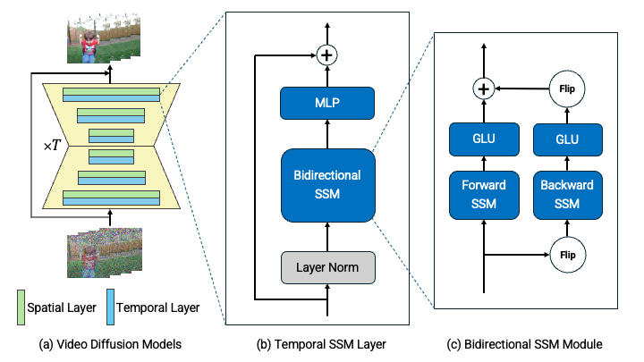

# SSM-Meets-Video-Diffusion-Models (WIP)

[Paper](https://arxiv.org/abs/2403.07711)




## Device Details
| Dataset          | UCF101         | UCF101         | MineRL         | MineRL         | MineRL         |
|------------------|----------------|----------------|----------------|----------------|----------------|
| **# of Frames**  | 16             | 16             | 64             | 200            | 400            |
| **Resolution**   | $32 \times 32$ | $64 \times 64$ | $32 \times 32$ | $32 \times 32$ | $32 \times 32$ |
| **Training steps** | 92k | 106k | 174k | 255k | 246k |
| **GPUs** | V100 $\times 4$ | A100 $\times 8$ | V100 $\times 4$ | A100 $\times 8$ | A100 $\times 8$ |
| **Training Time** | 72 hours | 120 hours | 72 hours | 100 hours | 120 hours |

## Settings
Please use `./Dockerfile` to build docker image or install python libraries specified in this dockerfile.

## Run Experimental Codes

### Downloading Datasets
#### UCF101
1. Please follow the commands shown in `./dl_ucf101.ipynb` to download datasets.
2.  Specify `ucf101-all` as `--dataset`, and `.` as `--folder`.

#### MineRL Navigate
1. Execute a following python code.
```
python dl_mine_rl.py
```
2. Specify `minerl` as `--dataset`, and `minerl_navigate-torch` as `--folder`.

### Training
```
python train_video-diffusion.py 
--timesteps 256 --loss_type 'l2' --train_lr 0.0003 --train_num_steps 700000 --train_batch_size 16 --gradient_accumulate_every 2 --ema_decay 0.995 # Learning Settings
--base_channel_size 64 --timeemb_linears 2 # Architecture Settings
--temporal_layer 'bi-s4d' --s4d_version 16 # Temporal Layer Settings
--image_size 32 --dataset 'ucf101-all' # Dataset Settings
--folder 'path/to/datasets' 
--results_folder 'path/to/save' 
--device_ids 0 1 2 3 # GPU Settings
```
### Sampling
```
python sample_video-diffusion.py 
--timesteps 256 --loss_type 'l2' --train_lr 0.0003 --train_num_steps 700000 --train_batch_size 16 --gradient_accumulate_every 2 --ema_decay 0.995 # Learning Settings
--base_channel_size 64 --timeemb_linears 2 # Architecture Settings
--temporal_layer 'bi-s4d' --s4d_version 16 # Temporal Layer Settings
--image_size 32 --dataset 'ucf101-all' # Dataset Settings
--folder 'path/to/datasets' 
--results_folder 'path/to/save'
--num_samples 2500 --sample_batch_size 10 --sample_save_every 10 # Sampling Number Settings
--milestone 92                                                   # Sampling Milestone (Progress of Learning) Settings
--device_ids 0 --seed 0                                          # Sampling Device Settings
```
### Evaluation
```
python eval_video-diffusion.py 
--timesteps 256 --loss_type 'l2' --train_lr 0.0003 --train_num_steps 700000 --train_batch_size 16 --gradient_accumulate_every 2 --ema_decay 0.995 # Learning Settings
--base_channel_size 64 --timeemb_linears 2 # Architecture Settings
--temporal_layer 'bi-s4d' --s4d_version 16 # Temporal Layer Settings
--image_size 32 --dataset 'ucf101-all' # Dataset Settings
--folder 'path/to/datasets' 
--results_folder 'path/to/save'
--num_samples 2500 --sample_batch_size 10 --sample_save_every 10 
--milestone 92                                                   
# --seed 0 --sample_seeds 0 1 2 3 --eval_batch_size 100 # Evaluation Settings
```