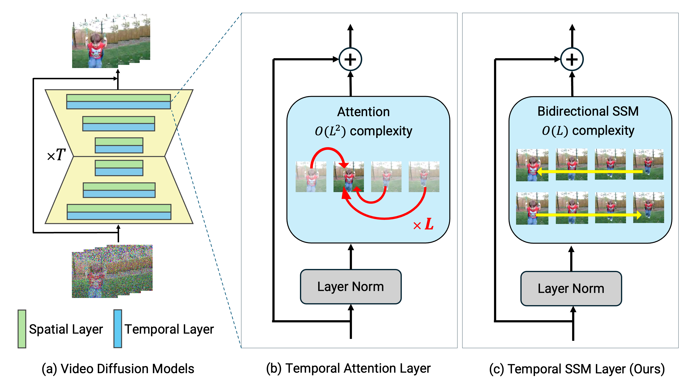
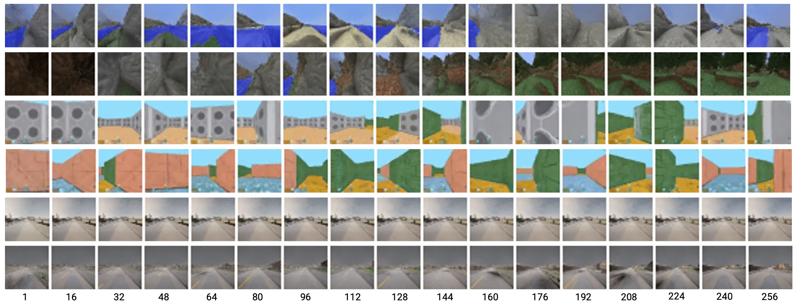

# SSM-Meets-Video-Diffusion-Models

"SSM Meets Video Diffusion Models: Efficient Long-Term Video Generation with Selective State Spaces" [[Paper]](https://arxiv.org/abs/2403.07711)



  

Past version implementation is in `past_repo/`.

## Devices
We use `NVIDIA A100 $\times 8$` for training.  
All models were trained for `100k steps`, and training for all configurations in the paper was completed `within four days`.

## Settings
Please use `./Dockerfile` to build docker image or install python libraries specified in this dockerfile.

## Run Experimental Codes

### Downloading Datasets
#### MineRL Navigate
1. Execute a following python code.
```
python dl_mine_rl.py
```
2. Specify `minerl` as `--dataset`, and `minerl_navigate-torch` as `--folder`.

#### GQN-Mazes
1. Execute a following python code.
```
python dl_gqn_mazes.py
```
2. Specify `gqn` as `--dataset`, and `gqn-mazes-torch` as `--folder`.

#### CARLA Town01
1. Execute a following python code.
```
cd carla
bash download.sh
python make_train_test_split.py --dir carla/no-traffic
cd ../
```
2. Specify `carla` as `--dataset`, and `carla/no-traffic` as `--folder`.

### Training
```
python train_video-diffusion.py 
--timesteps 256 --loss_type 'l2' --train_num_steps 110000 --train_lr 0.0001 --ema_decay 0.9999 --train_batch_size 8 --gradient_accumulate_every 1 # Learning Settings
--base_channel_size 112 --attn_dim_head 64 --attn_heads 14 # Architecture Settings
--temporal_layer 'bi-s6' --s4d_version 20 # Temporal Layer Settings
--image_size 32 --num_frames 256 --dataset 'minerl' # Dataset Settings
--folder 'path/to/datasets' 
--results_folder 'path/to/save' 
--device_ids 0 1 2 3 # GPU Settings
```
### Sampling
```
python sample_video-diffusion.py
--timesteps 256 --loss_type l2 --train_num_steps 110000 --train_lr 0.00001 --ema_decay 0.9999  --train_batch_size 8 --gradient_accumulate_every 1 # Learning Settings
--base_channel_size 112 --attn_dim_head 64 --attn_heads 14 # Architecture Settings
--image_size 32 --num_frames 256 --dataset 'minerl' # Dataset Settings
--folder 'path/to/datasets' 
--results_folder 'path/to/save' 
--num_samples 1000 --sample_batch_size 2 --sample_save_every 50 # Sampling Number Settings
--milestone 10 # Sampling Milestone (Progress of Learning) Settings
--device_ids 0 --seed 0 # Sampling Device and Seed Settings
```
### Evaluation
```
python eval_video-diffusion.py 
python sample_video-diffusion.py
--timesteps 256 --loss_type l2 --train_num_steps 110000 --train_lr 0.00001 --ema_decay 0.9999  --train_batch_size 8 --gradient_accumulate_every 1 # Learning Settings
--base_channel_size 112 --attn_dim_head 64 --attn_heads 14 # Architecture Settings
--image_size 32 --num_frames 256 --dataset 'minerl' # Dataset Settings
--folder 'path/to/datasets' 
--results_folder 'path/to/save' 
--num_samples 1000 --sample_batch_size 2 --sample_save_every 50 # Sampling Number Settings
--milestone 10 # Sampling Milestone (Progress of Learning) Settings
--device_ids 0 --seed 0 # Sampling Device and Seed Settings                                                 
--seed 0 --sample_seeds 0 --eval_batch_size 10 # Evaluation Settings
```

## Citation

```bibtex
@misc{ssmvdm2024,
      title={SSM Meets Video Diffusion Models: Efficient Video Generation with Structured State Spaces}, 
      author={Yuta Oshima and Shohei Taniguchi and Masahiro Suzuki and Yutaka Matsuo},
      year={2024},
      eprint={2403.07711},
      archivePrefix={arXiv},
      primaryClass={cs.CV}
}
```
  
